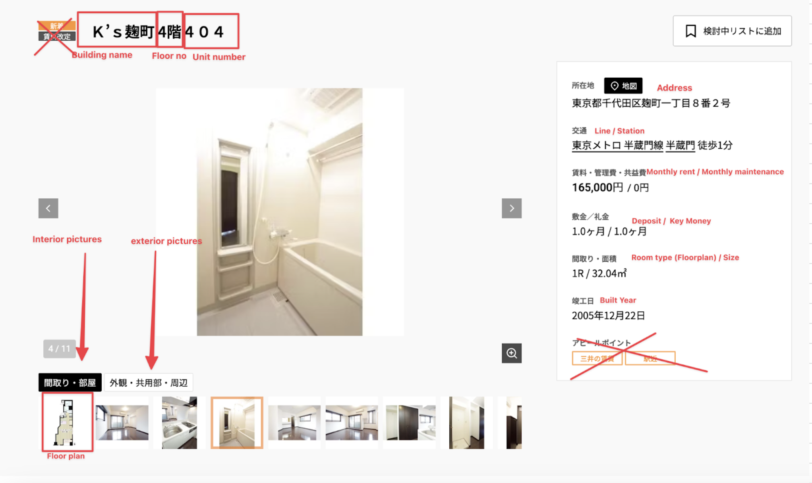
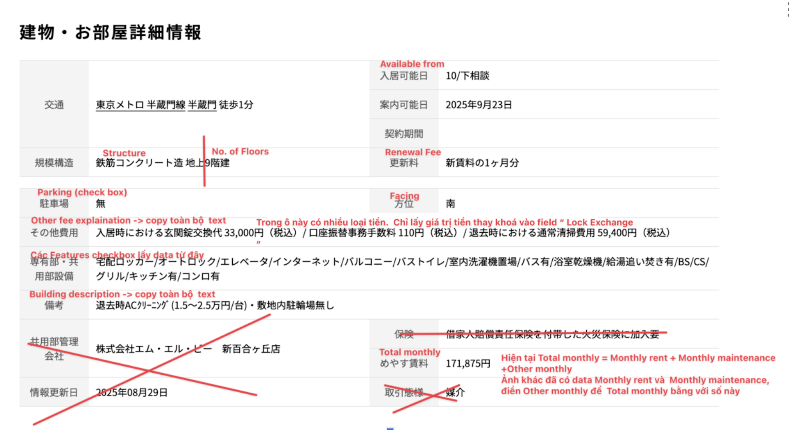

# Bmate VN Coding Contest - Property Data Crawler

Welcome to the coding round for Bmate VN recruitment!

## Objective

Write a Python script to crawl property data from a Japanese real estate website and map it to a specified output data structure.

## Requirements

- **Input:** A property listing URL (example: [https://www.mitsui-chintai.co.jp/rf/tatemono/10815/201](https://www.mitsui-chintai.co.jp/rf/tatemono/10815/201))
- **Output:** Print a dictionary with the following format, filling values crawled from the URL.  
  If any field does not exist in the source, set its value to `None`.

<details>
<summary>Click to view output format</summary>

```python
{
  "link": "URL to the property listing.",
  "property_csv_id": "Unique identifier for the property in CSV format.",
  "postcode": "Postal code of the property.",
  "prefecture": "Prefecture where the property is located.",
  "city": "City where the property is located.",
  "district": "District or ward of the property.",
  "chome_banchi": "Block and lot number (Japanese address system).",
  "building_type": "Type of building (e.g., apartment, house).",
  "year": "Year the building was constructed.",
  "building_name_en": "Building name in English.",
  "building_name_ja": "Building name in Japanese.",
  "building_name_zh_CN": "Building name in Simplified Chinese.",
  "building_name_zh_TW": "Building name in Traditional Chinese.",
  "building_description_en": "Description of the building in English.",
  "building_description_ja": "Description of the building in Japanese.",
  "building_description_zh_CN": "Description of the building in Simplified Chinese.",
  "building_description_zh_TW": "Description of the building in Traditional Chinese.",
  "building_landmarks_en": "Nearby landmarks in English.",
  "building_landmarks_ja": "Nearby landmarks in Japanese.",
  "building_landmarks_zh_CN": "Nearby landmarks in Simplified Chinese.",
  "building_landmarks_zh_TW": "Nearby landmarks in Traditional Chinese.",
  "station_name_1": "Name of the nearest train station (1st).",
  "train_line_name_1": "Train line name for station 1.",
  "walk_1": "Walking time to station 1 (minutes).",
  "bus_1": "Bus time to station 1 (minutes).",
  "car_1": "Car time to station 1 (minutes).",
  "cycle_1": "Bicycle time to station 1 (minutes).",
  "station_name_2": "Name of the second nearest train station.",
  "train_line_name_2": "Train line name for station 2.",
  "walk_2": "Walking time to station 2 (minutes).",
  "bus_2": "Bus time to station 2 (minutes).",
  "car_2": "Car time to station 2 (minutes).",
  "cycle_2": "Bicycle time to station 2 (minutes).",
  "station_name_3": "Name of the third nearest train station.",
  "train_line_name_3": "Train line name for station 3.",
  "walk_3": "Walking time to station 3 (minutes).",
  "bus_3": "Bus time to station 3 (minutes).",
  "car_3": "Car time to station 3 (minutes).",
  "cycle_3": "Bicycle time to station 3 (minutes).",
  "station_name_4": "Name of the fourth nearest train station.",
  "train_line_name_4": "Train line name for station 4.",
  "walk_4": "Walking time to station 4 (minutes).",
  "bus_4": "Bus time to station 4 (minutes).",
  "car_4": "Car time to station 4 (minutes).",
  "cycle_4": "Bicycle time to station 4 (minutes).",
  "station_name_5": "Name of the fifth nearest train station.",
  "train_line_name_5": "Train line name for station 5.",
  "walk_5": "Walking time to station 5 (minutes).",
  "bus_5": "Bus time to station 5 (minutes).",
  "car_5": "Car time to station 5 (minutes).",
  "cycle_5": "Bicycle time to station 5 (minutes).",
  "map_lat": "Latitude of the property location.",
  "map_lng": "Longitude of the property location.",
  "num_units": "Number of units in the building.",
  "floors": "Number of floors in the building.",
  "basement_floors": "Number of basement floors.",
  "parking": "Is parking available? ('Y' or 'N')",
  "parking_cost": "Cost of parking (monthly).",
  "bicycle_parking": "Is bicycle parking available? ('Y' or 'N')",
  "motorcycle_parking": "Is motorcycle parking available? ('Y' or 'N')",
  "structure": "Building structure type (e.g., steel, wood, other).",
  "building_notes": "Additional notes about the building.",
  "building_style": "Style of the building (e.g., normal, luxury).",
  "autolock": "Is there an auto-lock system? ('Y' or 'N')",
  "credit_card": "Are credit cards accepted? ('Y' or 'N')",
  "concierge": "Is there a concierge service? ('Y' or 'N')",
  "delivery_box": "Is there a delivery box? ('Y' or 'N')",
  "elevator": "Is there an elevator? ('Y' or 'N')",
  "gym": "Is there a gym? ('Y' or 'N')",
  "newly_built": "Is the building newly built? ('Y' or 'N')",
  "pets": "Are pets allowed? ('Y' or 'N')",
  "swimming_pool": "Is there a swimming pool? ('Y' or 'N')",
  "ur": "Is it an Urban Renaissance property? ('Y' or 'N')",
  "room_type": "Type of room/floorplan (e.g., 1K, 2DK).",
  "size": "Size of the room (square meters).",
  "unit_no": "Unit number.",
  "ad_type": "Type of advertisement (e.g., agency, owner).",
  "available_from": "Date when the property is available.",
  "property_description_en": "Description of the property in English.",
  "property_description_ja": "Description of the property in Japanese.",
  "property_description_zh_CN": "Description of the property in Simplified Chinese.",
  "property_description_zh_TW": "Description of the property in Traditional Chinese.",
  "property_other_expenses_en": "Other expenses (English).",
  "property_other_expenses_ja": "Other expenses (Japanese).",
  "property_other_expenses_zh_CN": "Other expenses (Simplified Chinese).",
  "property_other_expenses_zh_TW": "Other expenses (Traditional Chinese).",
  "featured_a": "Is it featured type A? ('Y' or 'N')",
  "featured_b": "Is it featured type B? ('Y' or 'N')",
  "featured_c": "Is it featured type C? ('Y' or 'N')",
  "floor_no": "Floor number of the unit.",
  "monthly_rent": "Monthly rent amount.",
  "monthly_maintenance": "Monthly maintenance fee.",
  "months_deposit": "Deposit required (months).",
  "numeric_deposit": "Deposit required (amount).",
  "months_key": "Key money required (months).",
  "numeric_key": "Key money required (amount).",
  "months_guarantor": "Guarantor fee required (months).",
  "numeric_guarantor": "Guarantor fee required (amount).",
  "months_agency": "Agency fee required (months).",
  "numeric_agency": "Agency fee required (amount).",
  "months_renewal": "Renewal fee required (months).",
  "numeric_renewal": "Renewal fee required (amount).",
  "months_deposit_amortization": "Deposit amortization (months).",
  "numeric_deposit_amortization": "Deposit amortization (amount).",
  "months_security_deposit": "Security deposit required (months).",
  "numeric_security_deposit": "Security deposit required (amount).",
  "lock_exchange": "Lock exchange fee.",
  "fire_insurance": "Fire insurance fee.",
  "other_initial_fees": "Other initial fees.",
  "other_subscription_fees": "Other subscription fees.",
  "no_guarantor": "Is no guarantor required? ('Y' or 'N')",
  "guarantor_agency": "Guarantor agency requirement.",
  "guarantor_agency_name": "Name of the guarantor agency.",
  "rent_negotiable": "Is rent negotiable? ('Y' or 'N')",
  "renewal_new_rent": "Is new rent applied on renewal? ('Y' or 'N')",
  "lease_date": "Lease start date.",
  "lease_months": "Lease duration in months.",
  "lease_type": "Type of lease (e.g., regular, short-term).",
  "short_term_ok": "Is short-term lease allowed? ('Y' or 'N')",
  "balcony_size": "Size of the balcony (square meters).",
  "property_notes": "Additional notes about the property.",
  "facing_north": "Is the unit facing north? ('Y' or 'N')",
  "facing_northeast": "Is the unit facing northeast? ('Y' or 'N')",
  "facing_east": "Is the unit facing east? ('Y' or 'N')",
  "facing_southeast": "Is the unit facing southeast? ('Y' or 'N')",
  "facing_south": "Is the unit facing south? ('Y' or 'N')",
  "facing_southwest": "Is the unit facing southwest? ('Y' or 'N')",
  "facing_west": "Is the unit facing west? ('Y' or 'N')",
  "facing_northwest": "Is the unit facing northwest? ('Y' or 'N')",
  "aircon": "Is air conditioning available? ('Y' or 'N')",
  "aircon_heater": "Is aircon with heater available? ('Y' or 'N')",
  "all_electric": "Is the unit all electric? ('Y' or 'N')",
  "auto_fill_bath": "Is auto-fill bath available? ('Y' or 'N')",
  "balcony": "Is there a balcony? ('Y' or 'N')",
  "bath": "Is there a bath? ('Y' or 'N')",
  "bath_water_heater": "Is there a bath water heater? ('Y' or 'N')",
  "blinds": "Are blinds available? ('Y' or 'N')",
  "bs": "Is BS (broadcast satellite) available? ('Y' or 'N')",
  "cable": "Is cable TV available? ('Y' or 'N')",
  "carpet": "Is carpet flooring available? ('Y' or 'N')",
  "cleaning_service": "Is cleaning service available? ('Y' or 'N')",
  "counter_kitchen": "Is there a counter kitchen? ('Y' or 'N')",
  "dishwasher": "Is dishwasher available? ('Y' or 'N')",
  "drapes": "Are drapes available? ('Y' or 'N')",
  "female_only": "Is the unit female-only? ('Y' or 'N')",
  "fireplace": "Is there a fireplace? ('Y' or 'N')",
  "flooring": "Is there flooring? ('Y' or 'N')",
  "full_kitchen": "Is there a full kitchen? ('Y' or 'N')",
  "furnished": "Is the unit furnished? ('Y' or 'N')",
  "gas": "Is gas available? ('Y' or 'N')",
  "induction_cooker": "Is induction cooker available? ('Y' or 'N')",
  "internet_broadband": "Is broadband internet available? ('Y' or 'N')",
  "internet_wifi": "Is WiFi available? ('Y' or 'N')",
  "japanese_toilet": "Is there a Japanese-style toilet? ('Y' or 'N')",
  "linen": "Is linen provided? ('Y' or 'N')",
  "loft": "Is there a loft? ('Y' or 'N')",
  "microwave": "Is microwave available? ('Y' or 'N')",
  "oven": "Is oven available? ('Y' or 'N')",
  "phoneline": "Is phone line available? ('Y' or 'N')",
  "range": "Is range available? ('Y' or 'N')",
  "refrigerator": "Is refrigerator available? ('Y' or 'N')",
  "refrigerator_freezer": "Is refrigerator with freezer available? ('Y' or 'N')",
  "roof_balcony": "Is there a roof balcony? ('Y' or 'N')",
  "separate_toilet": "Is there a separate toilet? ('Y' or 'N')",
  "shower": "Is there a shower? ('Y' or 'N')",
  "soho": "Is SOHO (small office/home office) allowed? ('Y' or 'N')",
  "storage": "Is storage available? ('Y' or 'N')",
  "student_friendly": "Is the unit student-friendly? ('Y' or 'N')",
  "system_kitchen": "Is there a system kitchen? ('Y' or 'N')",
  "tatami": "Is there tatami flooring? ('Y' or 'N')",
  "underfloor_heating": "Is underfloor heating available? ('Y' or 'N')",
  "unit_bath": "Is there a unit bath? ('Y' or 'N')",
  "utensils_cutlery": "Are utensils and cutlery provided? ('Y' or 'N')",
  "veranda": "Is there a veranda? ('Y' or 'N')",
  "washer_dryer": "Is washer/dryer available? ('Y' or 'N')",
  "washing_machine": "Is washing machine available? ('Y' or 'N')",
  "washlet": "Is there a washlet (bidet toilet)? ('Y' or 'N')",
  "western_toilet": "Is there a western-style toilet? ('Y' or 'N')",
  "yard": "Is there a yard? ('Y' or 'N')",
  "youtube": "YouTube video link for the property.",
  "vr_link": "Virtual reality tour link for the property.",
  "image_category_1": "Category for image 1.",
  "image_url_1": "URL for image 1.",
  "image_category_2": "Category for image 2.",
  "image_url_2": "URL for image 2.",
  "image_category_3": "Category for image 3.",
  "image_url_3": "URL for image 3.",
  "image_category_4": "Category for image 4.",
  "image_url_4": "URL for image 4.",
  "image_category_5": "Category for image 5.",
  "image_url_5": "URL for image 5.",
  "image_category_6": "Category for image 6.",
  "image_url_6": "URL for image 6.",
  "image_category_7": "Category for image 7.",
  "image_url_7": "URL for image 7.",
  "image_category_8": "Category for image 8.",
  "image_url_8": "URL for image 8.",
  "image_category_9": "Category for image 9.",
  "image_url_9": "URL for image 9.",
  "image_category_10": "Category for image 10.",
  "image_url_10": "URL for image 10.",
  "image_category_11": "Category for image 11.",
  "image_url_11": "URL for image 11.",
  "image_category_12": "Category for image 12.",
  "image_url_12": "URL for image 12.",
  "image_category_13": "Category for image 13.",
  "image_url_13": "URL for image 13.",
  "image_category_14": "Category for image 14.",
  "image_url_14": "URL for image 14.",
  "image_category_15": "Category for image 15.",
  "image_url_15": "URL for image 15.",
  "image_category_16": "Category for image 16.",
  "image_url_16": "URL for image 16.",
  "numeric_guarantor_max": "Maximum guarantor fee (amount).",
  "discount": "Discount amount.",
  "create_date": "Date the property was created (timestamp).",
}
```
</details>

## How to Participate

1. **Clone this repository.**
2. **Write your solution in `result.py`.**
3. **Your script must accept a command-line argument:**
   ```
   python result.py --url <source_data_url>
   ```
4. **Output:** Print the dictionary described above, with values crawled from the given URL.

## Guidelines

- If a field is missing in the source, set its value to `None`.
- Use Python **3.10 or higher**.
- Write **clean and maintainable code**.
- You may use any libraries (e.g., BeautifulSoup, requests, etc.).

### UI/UX Mapping Guidelines

Below are two images showing how to match fields from the website UI to the JSON output object:

<p align="center">
  
</p>
<p align="center">
  
</p>

## Example

```bash
python result.py --url https://www.mitsui-chintai.co.jp/rf/tatemono/10815/201
```

## Submission

- Submit your completed `result.py` file.

---

Good luck!

